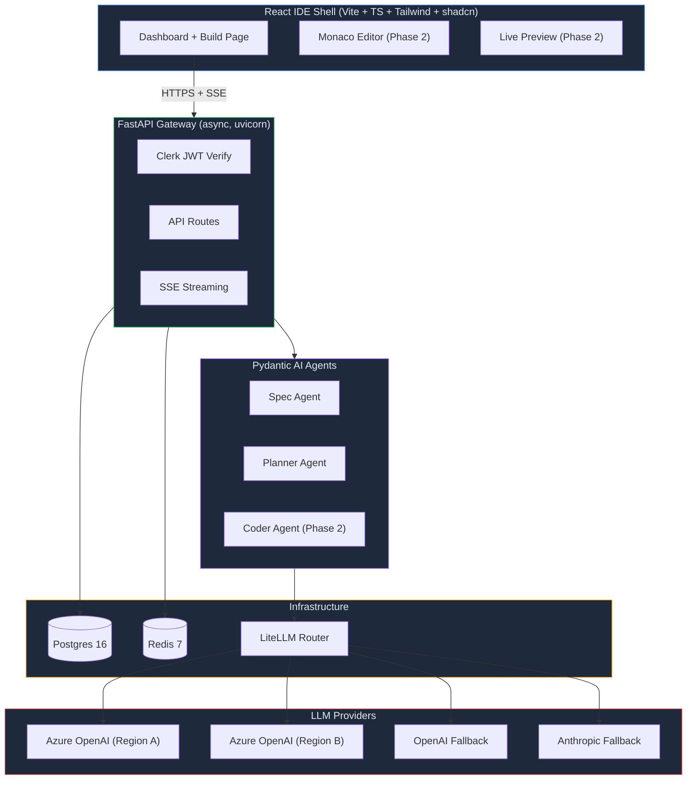
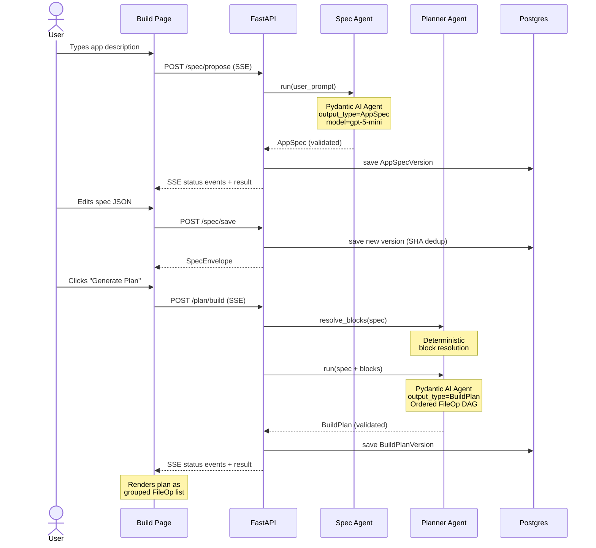
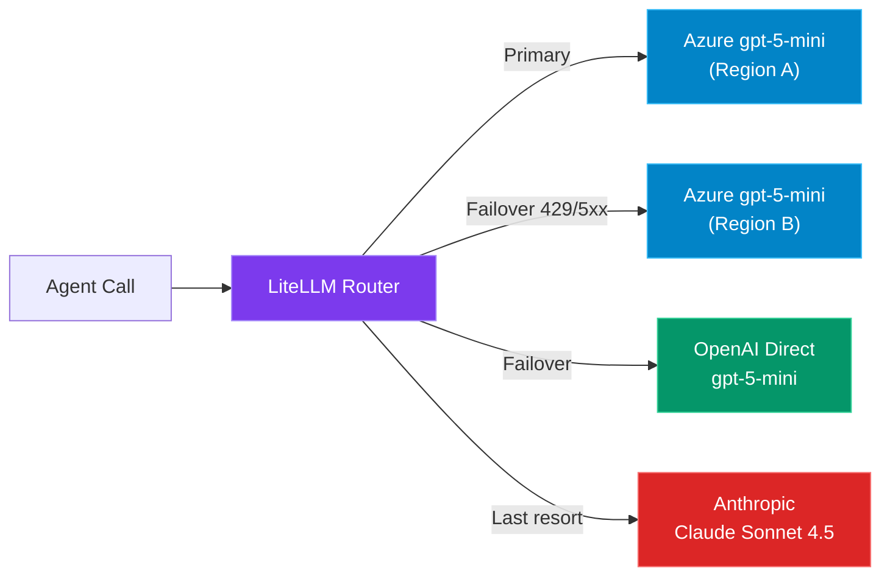

# Alloy

> **The Python-first AI code generator.** Every dominant AI code-generator today (Bolt, v0, Lovable, Cursor Composer, Replit Agent) is Node/Next/Supabase-centric because in-browser WASM runtimes can't run FastAPI. A Python-first generator with per-project cloud sandboxes and a fine-tuned apply model is a genuine market gap.

---

## Progress

| Phase | Status | Weeks | Summary |
|-------|--------|-------|---------|
| **Phase 0 — Foundation** | ✅ Complete | 1–2 | Monorepo, Docker Compose, FastAPI gateway, Clerk auth, Azure OpenAI wiring, CI |
| **Phase 1 — Core Generation** | ✅ Complete | 3–6 | Spec Agent, Planner Agent, AppSpec/BuildPlan schemas, project persistence, streaming SSE endpoints, Build page UI, LiteLLM router |
| Phase 2 — Surgical Edits | 🔲 Next | 7–9 | Morph Fast-Apply, visual element picker, checkpoints |
| Phase 3 — GitHub + Docker + Vercel | 🔲 | 10–12 | One-click deploy pipeline |
| Phase 4 — Production Hardening | 🔲 | 13–16 | Billing, RLS, prompt-injection defenses |
| Phase 5 — Launch Prep | 🔲 | 17–18 | Templates, SOC 2, public beta |

---

## Stack at a glance

| Layer            | Pick |
| ---------------- | ---- |
| Planner LLM      | Azure OpenAI `gpt-5-mini` (two regions, LiteLLM router, OpenAI + Claude fallbacks) |
| Apply LLM        | Morph `v3-fast` primary, Relace Apply 3 fallback (self-host later) |
| Orchestration    | Pydantic AI agents + LangGraph outer loop |
| Gateway          | FastAPI (async, stateless), Arq workers on Redis |
| Data plane       | Postgres (Neon in prod, local Postgres 16 in dev), Row-Level Security |
| Auth             | Clerk (Pro tier), WorkOS for enterprise SSO |
| Sandbox          | Daytona Cloud (primary), Fly Sprites (scale-out), Sandpack (lite preview) |
| Deploy targets   | GitHub App → Vercel (frontend) → Railway / Azure Container Apps (backend) |
| Observability    | Langfuse (self-host), Sentry, PostHog, Axiom |
| Object storage   | Cloudflare R2 |

See `roadmap.txt` for the full 18-week plan.

---

## Architecture

### System overview



### Code generation pipeline (Phase 1)



### LLM routing & fallback cascade



---

## Code structure

```
alloy/
├── .github/
│   └── workflows/
│       └── ci.yml                        # CI: ruff + mypy + pytest + tsc + eslint + vitest + Docker smoke
│
├── apps/
│   ├── api/                              # FastAPI backend (Python, uv-managed)
│   │   ├── Dockerfile                    # Multi-stage: uv + slim-bookworm
│   │   ├── alembic.ini
│   │   ├── alembic/
│   │   │   ├── env.py                    # Alembic env with async engine
│   │   │   └── versions/
│   │   │       └── 0001_phase1_projects.py  # Projects + AppSpecVersions + BuildPlanVersions
│   │   ├── app/
│   │   │   ├── main.py                   # FastAPI app, lifespan, CORS, Sentry
│   │   │   ├── agents/
│   │   │   │   ├── models.py             # Azure OpenAI ↔ Pydantic AI model factory
│   │   │   │   ├── spec_agent.py         # Spec Agent: prompt → AppSpec
│   │   │   │   ├── planner_agent.py      # Planner Agent: AppSpec → BuildPlan
│   │   │   │   └── prompts/
│   │   │   │       ├── spec_agent.md     # System prompt for spec extraction
│   │   │   │       └── planner_agent.md  # System prompt for plan generation
│   │   │   ├── api/
│   │   │   │   ├── router.py             # Top-level router (health, ping, generate, spec, plan)
│   │   │   │   ├── deps.py               # Clerk JWT + DB session dependencies
│   │   │   │   └── routes/
│   │   │   │       ├── health.py         # GET /health, GET /ready
│   │   │   │       ├── ping.py           # GET /ping (auth smoke test)
│   │   │   │       ├── generate.py       # POST /generate/echo (LLM streaming smoke)
│   │   │   │       ├── spec.py           # POST /spec/propose, POST /spec/save, GET /spec/{id}
│   │   │   │       └── plan.py           # POST /plan/build, GET /plan/{id}
│   │   │   ├── core/
│   │   │   │   ├── config.py             # Pydantic Settings (all env vars)
│   │   │   │   ├── db.py                 # Async SQLAlchemy session factory
│   │   │   │   ├── clerk.py              # Clerk JWT verification + dev bootstrap
│   │   │   │   ├── llm.py                # LiteLLM router + raw Azure OpenAI client
│   │   │   │   └── logging.py            # structlog configuration
│   │   │   ├── models/
│   │   │   │   └── project.py            # Project, AppSpecVersion, BuildPlanVersion (SQLModel)
│   │   │   ├── services/
│   │   │   │   └── projects.py           # CRUD: create project, save spec/plan versions
│   │   │   └── workers/
│   │   │       └── arq_worker.py         # Arq background worker (placeholder tasks)
│   │   ├── tests/
│   │   │   ├── test_health.py            # Health + readiness endpoint tests
│   │   │   ├── test_spec_agent.py        # Spec Agent unit tests (TestModel)
│   │   │   └── test_planner_agent.py     # Planner Agent unit tests (TestModel)
│   │   ├── pyproject.toml                # Python deps (FastAPI, Pydantic AI, LiteLLM, etc.)
│   │   └── uv.lock
│   │
│   └── web/                              # React IDE shell (Vite + TS + Tailwind + shadcn)
│       ├── Dockerfile                    # Multi-stage: Node 22 + nginx-unprivileged
│       ├── nginx.conf                    # SPA fallback, long-cache immutable assets
│       ├── index.html
│       ├── vite.config.ts                # Dev proxy /api → localhost:8000
│       ├── vitest.config.ts
│       ├── openapi-ts.config.ts          # @hey-api/openapi-ts client codegen config
│       ├── eslint.config.js
│       ├── tsconfig.json
│       ├── package.json
│       └── src/
│           ├── main.tsx                  # React root + QueryClient + AuthProvider + Router
│           ├── App.tsx                   # Routes: /, /build, /sign-in
│           ├── index.css                 # Global styles + CSS variables
│           ├── auth/
│           │   ├── AuthProvider.tsx       # Clerk / dev-bootstrap auth provider
│           │   └── identity.ts           # useIdentity() hook
│           ├── components/ui/
│           │   ├── button.tsx            # shadcn Button
│           │   └── card.tsx              # shadcn Card
│           ├── lib/
│           │   ├── api.ts               # Fetch wrapper with SSE streaming + structured streamJson
│           │   └── cn.ts                 # clsx + tailwind-merge
│           ├── pages/
│           │   ├── Dashboard.tsx         # Ping card + Azure OpenAI echo card
│           │   ├── Build.tsx             # Prompt → Spec → Plan wizard (Phase 1 UI)
│           │   └── SignIn.tsx            # Clerk sign-in page
│           └── test/
│               └── ...                  # Vitest test files
│
├── packages/
│   └── shared/                           # AppSpec + BuildPlan schemas (Python ↔ TS mirror)
│       ├── python/
│       │   └── alloy_shared/
│       │       ├── __init__.py
│       │       ├── spec.py              # AppSpec, Entity, Route, Page, Integration, AuthConfig
│       │       └── plan.py              # BuildPlan, FileOp, FileOpKind
│       └── ts/
│           └── src/
│               ├── index.ts
│               ├── spec.ts              # TypeScript AppSpec types
│               └── plan.ts              # TypeScript BuildPlan types
│
├── templates/
│   └── base-react-fastapi/               # Canonical base template (Copier-managed)
│       ├── copier.yml
│       ├── backend/                     # FastAPI + SQLModel + Alembic skeleton
│       ├── frontend/                    # Vite + React + TS + Tailwind skeleton
│       ├── compose.yml
│       └── ALLOY.md
│
├── compose.yml                           # Dev stack: api + web + postgres + redis
├── compose.override.yml                  # Local volume overrides
├── dev.sh                                # One-command dev start/stop
├── pnpm-workspace.yaml                   # JS workspace: apps/web + packages/shared/ts
├── package.json                          # Root scripts (web:dev, etc.)
├── .env.example                          # All service keys documented
├── .editorconfig
├── .gitignore
├── roadmap.txt                           # Full 18-week architecture + build plan
└── README.md                             # ← You are here
```

---

## What we built

### Phase 0 — Foundation (weeks 1–2) ✅

The ground-floor infrastructure that everything Phase 1+ builds on:

- **Monorepo skeleton** — `apps/api` (FastAPI + uv), `apps/web` (Vite + React + TS + Tailwind + shadcn), `packages/shared` (typed schemas mirrored Python ↔ TS)
- **Docker Compose** dev stack — Postgres 16, Redis 7, API, and web containers with health checks
- **FastAPI gateway** — async, stateless, CORS, structured logging (structlog), Sentry integration
- **Clerk auth** — JWT verification middleware with a dev-bootstrap mode (no real token needed locally)
- **Azure OpenAI wiring** — streaming `POST /generate/echo` endpoint to smoke-test gpt-5-mini
- **Health endpoints** — `GET /health` (liveness), `GET /ready` (checks Postgres + Redis)
- **CI pipeline** — GitHub Actions running ruff, mypy, pytest, tsc, eslint, vitest, plus a Docker Compose smoke test
- **Dev script** — `./dev.sh` one-command start/stop with auto-migration
- **Dashboard UI** — Ping card + Azure OpenAI echo streaming card

### Phase 1 — Core Generation (weeks 3–6) ✅

The AI-driven spec-to-plan pipeline — the core loop that turns a natural-language prompt into a structured application blueprint:

#### Shared Schemas (`packages/shared`)

Typed Pydantic + TypeScript models that define the contract between agents and UI:

- **`AppSpec`** — entities (with field types, relations), routes (with permissions), pages (with data deps), integrations, auth config. Schema-versioned for forward compatibility.
- **`BuildPlan`** — ordered DAG of `FileOp` operations (create/modify/delete/move) with stable IDs, dependency edges, and intent descriptions. Selects base template + feature blocks.

#### Spec Agent (`app/agents/spec_agent.py`)

- **Pydantic AI agent** with `output_type=AppSpec` — the LLM is constrained to emit valid, schema-compliant JSON
- System prompt loaded from `prompts/spec_agent.md` (hot-swappable, future Langfuse versioning)
- Supports clarifying Q&A context injection
- Bounded retries (2) on validation failure
- Model: Azure gpt-5-mini via `AzureProvider`, `reasoning_effort=low`

#### Planner Agent (`app/agents/planner_agent.py`)

- **Deterministic block resolver** — maps `spec.auth` + `spec.integrations` to feature blocks (e.g. `auth/clerk`, `storage/r2`) with zero LLM cost
- **LLM planner** emits the ordered `BuildPlan` DAG: models → migrations → schemas → CRUD → routers → tests → OpenAPI → TS client → hooks → pages
- Server-side pinning of `blocks` and `spec_slug` to prevent LLM drift
- Same model settings as Spec Agent (low reasoning effort, bounded retries)

#### LLM Router (`app/core/llm.py`)

- **LiteLLM Router** with multi-provider cascade: Azure Region A → Azure Region B → OpenAI Direct → Anthropic Claude
- Lazy-imported to avoid module-level network checks at startup
- Configurable retries, cooldown, and failure thresholds
- Raw `AsyncAzureOpenAI` client kept for features LiteLLM doesn't surface yet

#### Project Persistence (`app/models/`, `app/services/`)

- **`Project`** table — tenant-scoped, slug-indexed, stores original prompt and current spec/plan pointers
- **`AppSpecVersion`** — append-only version history with SHA-256 dedup, origin tracking (`agent` / `user_edit`), model attribution
- **`BuildPlanVersion`** — append-only, linked to spec version, execution status tracking
- All tables carry `tenant_id` for Phase 4 RLS
- Alembic migration: `0001_phase1_projects.py`

#### Streaming API Endpoints

| Method | Path | Description |
|--------|------|-------------|
| `POST` | `/api/v1/spec/propose` | Run Spec Agent → stream SSE progress → return `AppSpec` |
| `POST` | `/api/v1/spec/save` | Persist user-edited spec (SHA-idempotent) |
| `GET` | `/api/v1/spec/{project_id}` | Fetch current spec for a project |
| `POST` | `/api/v1/plan/build` | Run Planner Agent → stream SSE progress → return `BuildPlan` |
| `GET` | `/api/v1/plan/{project_id}` | Fetch current plan for a project |

SSE protocol uses typed events (`status`, `result`, `error`) with JSON payloads — not raw token streaming — because agents emit structured output, not free-form text.

#### Build Page UI (`apps/web/src/pages/Build.tsx`)

Three-stage wizard:
1. **Prompt** — user describes the app in natural language
2. **Spec review** — rendered AppSpec with entity/route/page/integration counters + editable JSON textarea + save/re-propose
3. **Plan view** — BuildPlan rendered as grouped FileOp list with IDs, intents, and file paths

#### Frontend API Client (`apps/web/src/lib/api.ts`)

- `useApi()` hook with Clerk token injection
- `request<T>()` — standard JSON requests
- `stream()` — raw SSE for token streaming (echo endpoint)
- `streamJson<TStatus, TResult>()` — structured SSE for agent endpoints with typed `onStatus` / `onResult` / `onError` handlers

#### Tests

- `test_spec_agent.py` — Spec Agent with `TestModel` override (no Azure creds needed)
- `test_planner_agent.py` — Planner Agent with `TestModel` + deterministic block resolver
- `test_health.py` — Health/readiness endpoint integration tests

---

## API Surface

### Phase 0 endpoints

```
GET  /api/v1/health          → { "status": "ok" }
GET  /api/v1/ready           → { "status": "ok", "postgres": true, "redis": true }
GET  /api/v1/ping            → { "ok": true, "user_id": "...", "tenant_id": "..." }
POST /api/v1/generate/echo   → SSE stream of gpt-5-mini tokens
```

### Phase 1 endpoints

```
POST /api/v1/spec/propose    → SSE: status events → SpecEnvelope (project_id, spec)
POST /api/v1/spec/save       → SpecEnvelope (idempotent on SHA)
GET  /api/v1/spec/{id}       → SpecEnvelope
POST /api/v1/plan/build      → SSE: status events → PlanEnvelope (project_id, plan)
GET  /api/v1/plan/{id}       → PlanEnvelope
```

---

## Quickstart

### Prerequisites

| Tool             | Min version | Install |
| ---------------- | ----------- | ------- |
| Docker Desktop   | 25+         | https://docs.docker.com/desktop |
| `uv`             | 0.5+        | `brew install uv` |
| `pnpm`           | 9+          | `brew install pnpm` (or `corepack enable && corepack prepare pnpm@latest --activate`) |
| Node.js          | 22+ LTS     | `brew install node@22` |
| Python           | 3.12+       | `uv python install 3.12` (uv manages this automatically) |

Sanity check:

```bash
docker --version && uv --version && pnpm --version && node --version
```

### 1. Clone and seed env

```bash
git clone <this-repo> alloy && cd alloy
cp .env.example .env
```

Open `.env` and fill in at minimum:

```bash
AZURE_OPENAI_ENDPOINT="https://<your-resource>.openai.azure.com/"
AZURE_OPENAI_API_KEY="<your-key>"
AZURE_OPENAI_DEPLOYMENT="gpt-5-mini"     # deployment name in your Azure resource
AZURE_OPENAI_API_VERSION="2025-04-01-preview"

POSTGRES_PASSWORD="alloy-dev"             # anything — just keep api + db in sync
```

Everything else (`CLERK_*`, `GITHUB_APP_*`, `STRIPE_*`, etc.) can stay blank during Phase 0–1 — the backend detects `CLERK_ISSUER` is unset and enables a **dev-identity bootstrap** that returns `{"user_id": "dev_user", "tenant_id": "dev_tenant"}` without a real token.

### 2. One-command start

```bash
./dev.sh
```

This will:
- Start Postgres + Redis via Docker Compose
- Install Python deps (`uv sync`) and JS deps (`pnpm install`)
- Run Alembic migrations
- Start FastAPI on `:8000` and Vite on `:5173`

To stop: `./dev.sh stop`

### 3. Manual start (alternative)

```bash
# Infrastructure
docker compose up -d db redis

# Backend
cd apps/api && uv sync
uv run alembic upgrade head
uv run uvicorn app.main:app --reload --port 8000

# Frontend (separate terminal)
pnpm install
pnpm --filter web dev
```

### 4. Verify it's alive

```bash
# Liveness
curl -s http://localhost:8000/api/v1/health

# Readiness (checks Postgres + Redis)
curl -s http://localhost:8000/api/v1/ready

# Auth ping (dev bootstrap)
curl -s http://localhost:8000/api/v1/ping

# Azure OpenAI streaming smoke test
curl -N -X POST http://localhost:8000/api/v1/generate/echo \
  -H "Content-Type: application/json" \
  -d '{"prompt":"Give me a five-word slogan.","reasoning_effort":"low"}'
```

Then open:

- <http://localhost:5173> — React IDE shell
- <http://localhost:5173/build> — **Phase 1 Build page** (Prompt → Spec → Plan)
- <http://localhost:8000/api/v1/docs> — FastAPI OpenAPI explorer

### 5. Run the tests

```bash
# Backend
cd apps/api
uv run ruff check .
uv run ruff format --check .
uv run mypy app
uv run pytest -q
cd ../..

# Frontend
pnpm --filter web typecheck
pnpm --filter web lint
pnpm --filter web test -- --run
```

CI (`.github/workflows/ci.yml`) runs the same checks plus a Docker Compose smoke boot.

---

## Common gotchas

- **`/generate/echo` returns 500 "AZURE_OPENAI_ENDPOINT is required"** — fill in the Azure creds in `.env` and restart the API.
- **`/spec/propose` returns an SSE error "AgentModelConfigError"** — same cause: Azure OpenAI isn't configured. The Spec + Planner agents need Azure creds.
- **`ping` returns 401** — you set `CLERK_ISSUER` but didn't attach a real Clerk bearer. Either clear `CLERK_ISSUER` (dev bootstrap) or sign in through the React shell.
- **`alembic upgrade head` fails to connect** — make sure `docker compose up -d db` is up and `POSTGRES_PASSWORD` in `.env` matches what compose started Postgres with.
- **Vite fails with "Cannot find module @rollup/rollup-linux-*"** — you ran `pnpm install` on one OS and are trying to run Vite on another. Delete `node_modules` and reinstall.
- **`uv sync` pulls a new Python** — that's expected; uv manages its own interpreters under `~/.local/share/uv/python`.

---

## Roadmap

18-week, 2-senior-engineer plan documented in `roadmap.txt`. Phases:

0. Foundation (weeks 1–2) — ✅ **complete**
1. Core generation pipeline (weeks 3–6) — ✅ **complete**
2. Surgical edits: Morph + visual picker + checkpoints (weeks 7–9)
3. GitHub + Docker + Vercel integrations (weeks 10–12)
4. Production hardening: billing, RLS, prompt-injection defenses (weeks 13–16)
5. Launch prep: final templates, SOC 2 gap, public beta (weeks 17–18)

---

## License

TBD — private during build.
